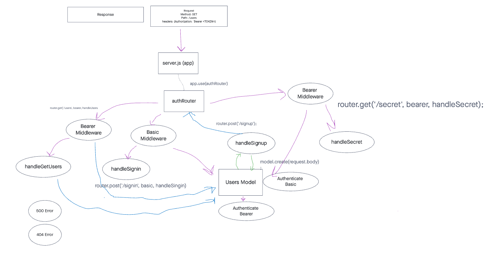

# Authorization API

This server api extend the restrictive capabilities of our routes to our API, implementing a fully functional, authenticated and authorized API Server using the latest coding techniques

restrictions:

Regular users can READ
Writers can READ and CREATE
Editors can READ, CREATE, and UPDATE
Administrators can READ, CREATE, UPDATE, and DELETE

## testing

install packages

    npm i

run test

    npm test

## UML

## API

AUTH Routes

- POST /signup creates a new user and sends an object with the user and the token to the client
- POST /signin with basic authentication headers logs in a user and sends an object with the user and the token to the client

V1 (Unauthenticated API) routes

- POST /api/v1/:model adds an item to the DB and returns an object with the added item
- GET /api/v1/:model returns a list of :model items
- GET /api/v1/:model/ID returns a single item by ID
- PUT /api/v1/:model/ID returns a single, updated item by ID
- DELETE /api/v1/:model/ID returns an empty object. Subsequent GET for the same ID should result in nothing found

V2 (Authenticated API Routes)

- POST /api/v2/:model with a bearer token that has create permissions adds an item to the DB and returns an object with the added item
- GET /api/v2/:model with a bearer token that has read permissions returns a list of :model items
- GET /api/v2/:model/ID with a bearer token that has read permissions returns a single item by ID
- PUT /api/v2/:model/ID with a bearer token that has update permissions returns a single, updated item by ID
- DELETE /api/v2/:model/ID with a bearer token that has delete permissions returns an empty object. Subsequent GET for the same ID should result in nothing found

### users routes

- POST localhost:3001/api/v2/signup
- POST localhost:3001/api/v2/signin
- GET localhost:3001/api/v2/users
- GET localhost:3001/api/v2/secret

### food routes

- POST localhost:3001/api/v1/food
- GET localhost:3001/api/v1/food
- GET localhost:3001/api/v1/food/id
- PUT localhost:3001/api/v1/food/id
- DElETE localhost:3001/api/v1/food/id
